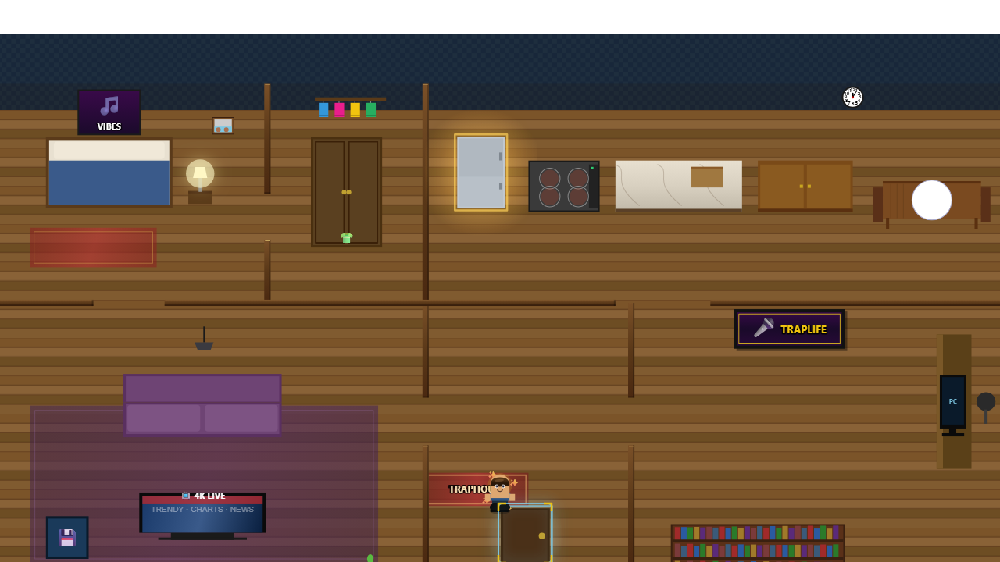
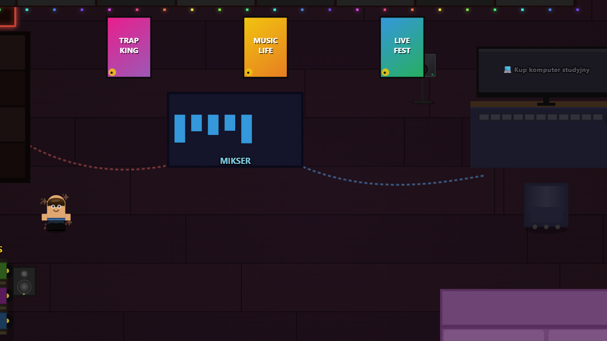
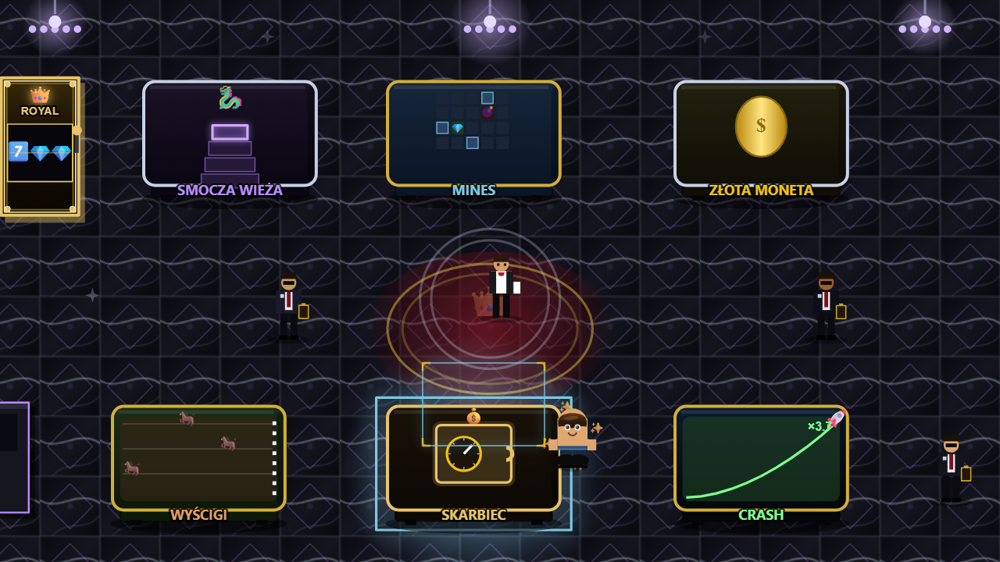
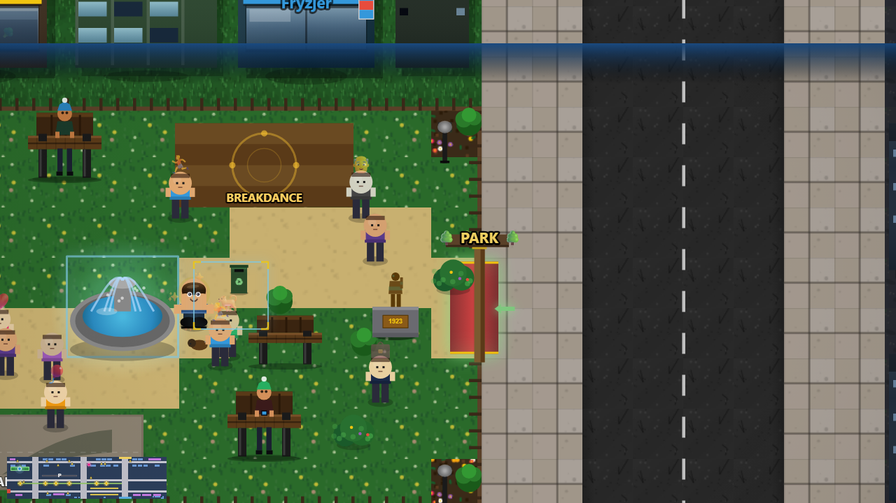
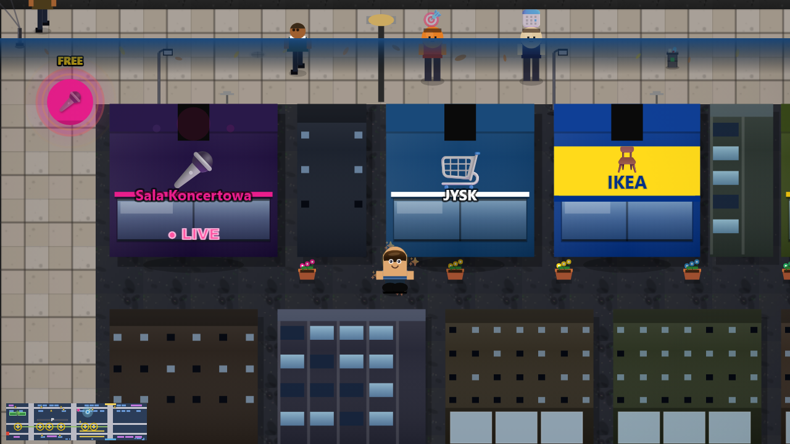
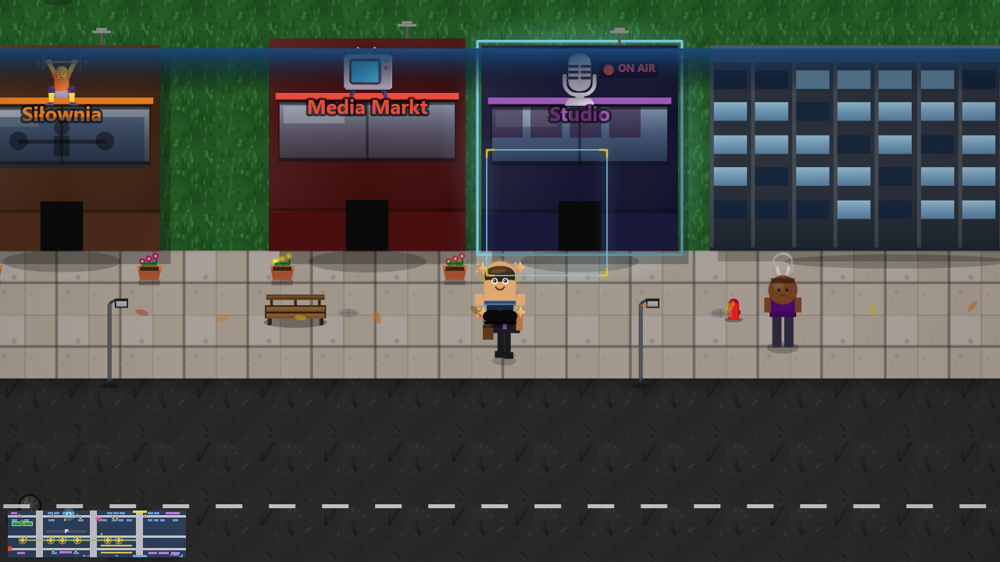

<div align="center">

# ▲ TRAP SIMULATOR

### Od ulicy do sławy — zbuduj imperium.

Polski symulator kariery rapera i ulicznego biznesu. Koncerty, trasy, albumy, radio i streaming, kasyno, dzielnice miasta, telefon z aplikacjami i własny biznes — wszystko w jednej grze 2D.

[](https://github.com/krysstiano/trap-simulator/releases/latest/download/Trap-Simulator-Setup.exe)
[](https://trap-simulator.pages.dev/play/)
[](https://trap-simulator.pages.dev/)

  

</div>

---

## 🎮 O grze

**TRAP SIMULATOR** to rozbudowany, polski symulator 2D, w którym budujesz karierę od zera — od ulicy po szczyt list przebojów i własne imperium. Łączysz świat muzyki z ekonomią, eksploracją miasta i dziesiątkami połączonych ze sobą systemów.

### Co znajdziesz w grze
- 🎤 **Kariera muzyczna** — koncerty, trasy, albumy, radio i streaming. Zbieraj fanów i piecz się na szczyt list przebojów.
- 🎰 **Kasyno** — sloty, ruletka, blackjack i autorskie gry losowe. Symulowany hazard, wyłącznie dla zabawy.
- 🏙️ **Dzielnice miasta** — Underground, Coast i Business District. Każda to nowe miejsca, postacie i okazje.
- 📱 **Telefon i aplikacje** — Instagram, bank, sejf, komunikatory i wewnątrzgrowe apki.
- 💼 **Ekwipunek i biznes** — przedmioty, ulepszenia, pracownicy i własna (fikcyjna) ekonomia uliczna.
- 🔄 **Częste aktualizacje** — setki poprawek i nowości napędzanych opiniami beta-testerów.

## 📸 Zrzuty ekranu

| | | |
|:-:|:-:|:-:|
|  |  |  |
|  |  |  |

## ⬇️ Pobieranie

- **Windows 10/11 (64-bit)** — [pobierz instalator](https://github.com/krysstiano/trap-simulator/releases/latest/download/Trap-Simulator-Setup.exe) (~166 MB, instalacja jednym klikiem, działa offline).
- **Przeglądarka** — [zagraj od razu](https://trap-simulator.pages.dev/play/), bez pobierania. Zapis trzymany lokalnie w przeglądarce.
- **macOS / Linux** — wkrótce.

> ℹ️ **Ostrzeżenie SmartScreen przy instalacji jest normalne** — instalator nie ma jeszcze płatnego certyfikatu wydawcy. Kliknij **„Więcej informacji" → „Uruchom mimo to"**. Kod źródłowy jest publiczny w tym repozytorium, a gra działa w pełni offline.

Wersja do pobrania **aktualizuje się automatycznie** do najnowszego wydania. Zapis trzymany jest lokalnie (`%APPDATA%\Trap Simulator`) i **przeżywa aktualizacje oraz odinstalowanie**.

## ⚠️ Treści dla dorosłych (18+)

Gra zawiera symulowany hazard, fikcyjne używki, tematykę uliczną, przemoc i wulgarny język. **To fikcja** — wewnątrzgrowa „waluta hazardu" nie ma realnej wartości i niczego nie wypłaca. Gra jest darmowa, bez mikropłatności.

## 🎬 Dla twórców i prasy

- Materiały (zrzuty): [`website/screeny/`](website/screeny/)
- Zwiastun / gameplay: [`website/gameplay-preview.webm`](website/gameplay-preview.webm)
- Strona z aktualnym opisem i changelogiem: <https://trap-simulator.pages.dev/>
- Można nagrywać i streamować bez ograniczeń.

## 🛠️ Build z kodu (dla deweloperów)

Gra to aplikacja desktop oparta na **Electron**, ładująca jednoplikową grę HTML5 Canvas (`index.html`).

```bash
# instalacja zależności
npm --prefix electron install

# uruchomienie w trybie dev
npm --prefix electron start

# zbudowanie instalatora Windows (bez podpisu)
CSC_IDENTITY_AUTO_DISCOVERY=false npm --prefix electron run dist
```

Wydania publikowane są automatycznie przez GitHub Actions (`.github/workflows/release.yml`) po wypchnięciu taga `vX.Y.Z`. Strona deployuje się na Cloudflare Pages po pushu na `main` (`.github/workflows/deploy-website.yml`).

## 📄 Prywatność i regulamin

[Polityka prywatności i regulamin](https://trap-simulator.pages.dev/prywatnosc.html).

---

<div align="center">
<sub>© 2026 TRAP SIMULATOR. Gra zawiera treści 18+. To fikcja — nie oferuje prawdziwego hazardu ani nie wypłaca nagród pieniężnych.</sub>
</div>
